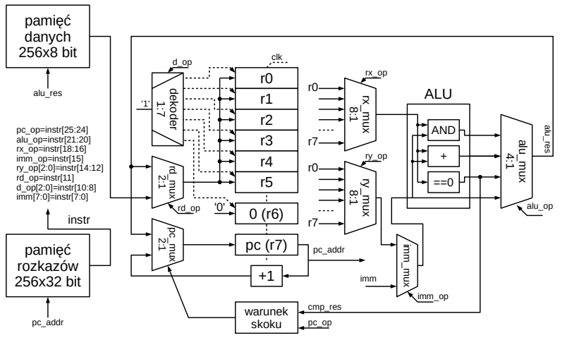

# Assembler parser for simple CPU

A script written in Rust to convert simple assembler instructions into machine code 
that can be run on a processor that was proposed in the “Reconfigurable Systems” lab 
class and then implemented on an FPGA board. 

### Processor diagram

## Instructions supported by the processor:

### mov
- **Syntax**: `mov Rd, Rx`
- **Operation**: 
  - Copies the value from register `Rx` to register `Rd`.

### movi
- **Syntax**: `movi Rd, imm`
- **Operation**: 
  - Stores the immediate value `imm` into register `Rd`.

### nop
- **Syntax**: `nop`
- **Operation**: 
  - No operation. The state of the registers (`R0`-`R6`) is not changed, and the next instruction is fetched.

### jump
- **Syntax**: `jump Rx`
- **Operation**: 
  - Sets the Program Counter (PC) to the value in register `Rx`. The next instruction is fetched from the location at the address in `Rx`.

### jumpi
- **Syntax**: `jumpi imm`
- **Operation**: 
  - Sets the Program Counter (PC) to the immediate value `imm`. The next instruction is fetched from the location at the address `imm`.

### jz
- **Syntax**: `jz Rx, imm`
- **Operation**: 
  - If the value in register `Rx` is 0, sets the Program Counter (PC) to the immediate value `imm`.

### jnz
- **Syntax**: `jnz Rx, imm`
- **Operation**: 
  - If the value in register `Rx` is not 0, sets the Program Counter (PC) to the immediate value `imm`.

### add
- **Syntax**: `add Rd, Rx, Ry`
- **Operation**: 
  - Adds the values in registers `Rx` and `Ry`, and stores the result in register `Rd`.

### addi
- **Syntax**: `addi Rd, Rx, imm`
- **Operation**: 
  - Adds the value in register `Rx` and the immediate value `imm`, and stores the result in register `Rd`.

### and
- **Syntax**: `and Rd, Rx, Ry`
- **Operation**: 
  - Performs a logical AND between the values in registers `Rx` and `Ry`, and stores the result in register `Rd`.

### andi
- **Syntax**: `andi Rd, Rx, imm`
- **Operation**: 
  - Performs a logical AND between the value in register `Rx` and the immediate value `imm`, and stores the result in register `Rd`.

### load
- **Syntax**: `load Rd, Rx`
- **Operation**: 
  - Loads the value from the data memory at the address specified by the value in register `Rx` into register `Rd`.

### loadi
- **Syntax**: `loadi Rd, imm`
- **Operation**: 
  - Loads the value from the data memory at the address specified by the immediate value `imm` into register `Rd`.

## Usage

In order to use this program, you need to write new lines of code in the “program.asm” file and then run the "assembler_parser.exe" program, however, you need to follow the syntax carefully. In case of an invalid instruction, the console will display a message describing the error, and the instruction will be skipped when writing to the output file, resulting in no information about the invalid instruction in the output file. The output file is "program.ms".
